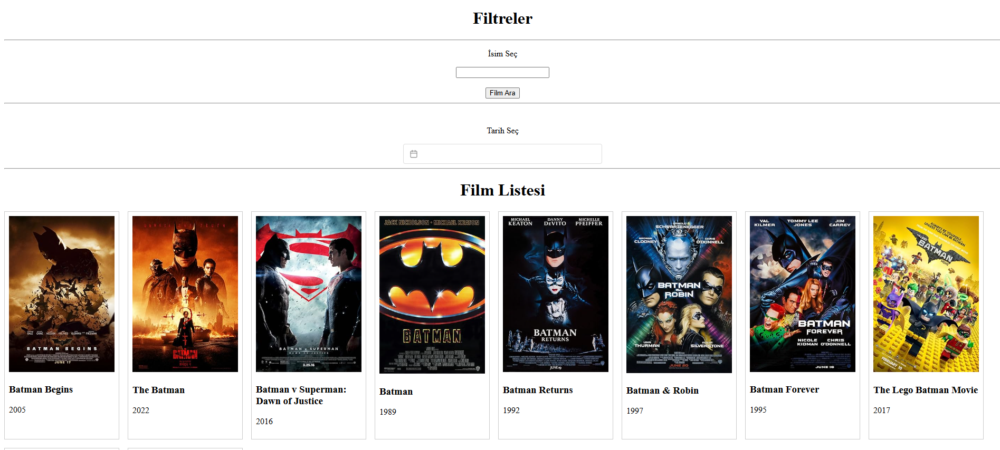

# Bilgilendirici Film Sitesi

OMDb API tarafından sağlanan ve çekilen verileri otomatik olarak getiren ve teker teker filmlere ait bilgileri ekrana düzgün şekilde yansıtan bir VUe3 projesidir. 
Filtreleme kısmında Vue3'e ait olan "Vue datepicker" kütüphanesi takvim için, String ile kullanıcıdan "Form" yoluyla alınan bilgi ise isim için filtreleme imkanı sunmaktadır.

## 🛠️ Kullanılan Teknolojiler

- Vue3
- Javascript
- Html
- Css

## 🔧 Kurulum

Projeyi çalıştırmak için:

İlk olarak; "https://vue3datepicker.com/" adresinden gerekli kuruumu kütüphaneyi kullanmak için yapmalıyız.

Daha sonra bulunduğu dosyanın terminaline; "npm run serve" yazılıp çalıştırılamsı yeterlidir.
